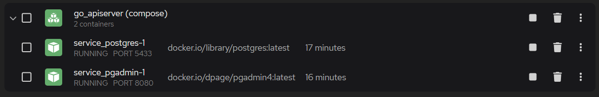

## 環境構築方法
### 1. クローンの生成
```shell
    git clone https://github.com/omusobadon/Go_APIServer.git
```
### 2. 環境変数ファイルの作成
    Discordの GO-API repo の環境変数ファイルを Go_APIServer/ へコピー

### 3. Prisma-Client-Goのインストール
```shell
    go get github.com/steebchen/prisma-client-go
```

### 4 docker-composeをpodman上でコンテナ起動
```shell
    docker-compose up -d
```
こんな感じで起動してると思います。


### 5. /Go_APIServer内で以下のコマンドを実行してDBを同期（DB操作用のパッケージが生成される）
```shell
    go run github.com/steebchen/prisma-client-go db push
```
localhost:8081にアクセスするとpgadmin4が出るので以下の情報でログイン
```
admin@example.com
password
```
めっちゃガバだけどどうしてもいやって人はdocker-composeの環境変数変えれば変更されるんでそれで。

以上

## ファイル一覧
- db/             prisma-client-goが作成したフォルダ。DB操作用のパッケージ等
- Go_APIServer    APIServerの本体
- GetTime         時刻同期処理
- schema          prismaの設定ファイル。DBのURLやテーブルの定義など
- TableEditer     APIServerから実行されるテーブル編集用のメソッド群
- TableMemo       作成するテーブルのメモ
- Tables          各テーブル用の構造体のまとめ
- test            テスト用


## POST /post
- POSTされた注文情報を取得して注文処理

- json形式
```json
{
    "customer": 1,
    "product": 1,
    "start": "2023-11-10T10:10:00+09:00",
    "end": "2023-11-10T18:10:00+09:00",
    "num": 1
}
```

## POST /edit
- 管理用
- POSTされたテーブル編集情報を取得して各テーブルを編集
- Type  1: Update, 2: Insert, 3: Delete
- Table テーブル名
- Info  更新内容

- 例）Insert
```json
{
    "type": 2,
    "table": "stock",
    "info": {
        "category": "car",
        "name": "car1",
        "value": 8000,
        "num": 22
    }
}
```
